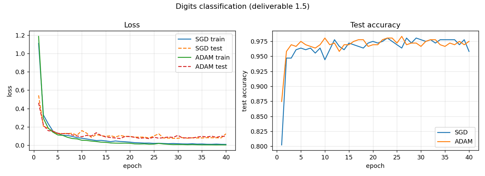
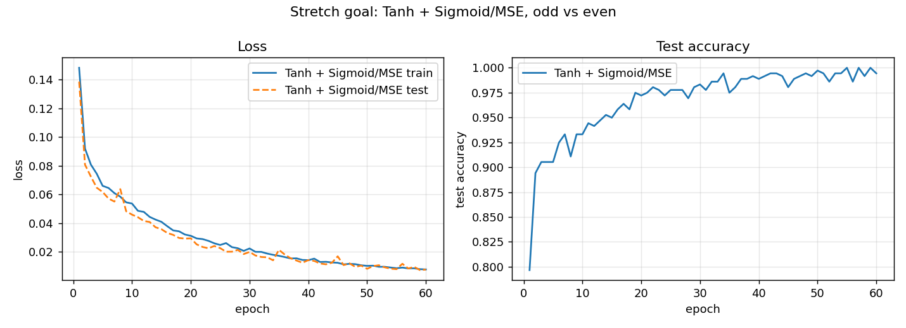

# Write-up — Task 1: Neural Network with Manual Backpropagation

**Task:** Task 1 — Neural Network with Manual Backpropagation
**Repository:** https://github.com/Kunal-Gidwani/postman-ai-ml-task-1

---

## 1. Overview

A small feedforward network built on NumPy matrix operations, with every
gradient derived by hand and implemented directly. Nothing in `src/` imports
`torch`; autograd appears only inside the correctness harness, where the task
brief explicitly allows it as a trusted reference.

The network trained for deliverable 1.5 is

```
Linear(64 -> 32) -> ReLU -> Linear(32 -> 10) -> Softmax + Cross-Entropy
```

on scikit-learn's `load_digits` (1797 real handwritten digits, 8×8 greyscale,
10 classes). It needs no download and writes nothing to disk, so no dataset
ends up committed to the repository.

I chose ReLU for the hidden activation because its derivative is a plain 0/1
mask, which keeps the interesting part of the derivation on the linear layer
and the loss rather than on algebra I would only be copying. Softmax with
cross-entropy is the natural output pairing for mutually exclusive classes, and
their combined gradient is clean for a reason worth understanding (section 2.4).

| Deliverable | Where |
|---|---|
| 1.1 network from matrix operations | [`src/network.py`](src/network.py), [`src/layers.py`](src/layers.py) |
| 1.2 forward pass, linear + activation | `Linear`, `ReLU` in [`src/layers.py`](src/layers.py) |
| 1.3 manual backward pass + derivations | `backward()` in every layer; section 2 below |
| 1.4 gradient check | [`gradient_check.py`](gradient_check.py), [`test_correctness.py`](test_correctness.py); section 3 |
| 1.5 training, loss decreases | [`train.py`](train.py); section 4 |
| 1.6 mistakes and how I found them | section 5 |
| Stretch: second activation–loss pair | Tanh + Sigmoid/MSE; section 2.5, section 4.2 |
| Stretch: optimizer | Momentum and Adam in [`src/optimizers.py`](src/optimizers.py) |

---

## 2. The gradients, derived

Notation: `N` is the batch size, inputs are `(N, d_in)` so one row is one
example, and `dA` is shorthand for `∂L/∂A`. Every gradient has exactly the same
shape as the quantity it differentiates.

### 2.1 Linear layer

Forward: `z = x W + b`, shapes `x (N, d_in)`, `W (d_in, d_out)`, `b (d_out,)`.

Elementwise, for example `i` and output unit `j`:

```
z[i, j] = Σ_k x[i, k] · W[k, j] + b[j]
```

**Weights.** `W[k, j]` enters only `z[:, j]`, once per example, multiplied by
`x[:, k]`. Chain rule, summing over the batch:

```
dW[k, j] = Σ_i dz[i, j] · ∂z[i, j]/∂W[k, j] = Σ_i dz[i, j] · x[i, k]
```

That double loop over `(k, j)` with a sum over `i` is exactly a matrix product:

```
dW = xᵀ dz            (d_in, N) @ (N, d_out) -> (d_in, d_out)
```

**Bias.** `b[j]` is added to `z[i, j]` for every example, and
`∂z[i, j]/∂b[j] = 1`, so the gradient accumulates across the batch:

```
db[j] = Σ_i dz[i, j]        ->   db = dz.sum(axis=0)
```

**Input.** `x[i, k]` feeds every output unit `j` of the same example, so sum
over `j`. Summing over the second index of `W` is a product with `Wᵀ`:

```
dx = dz Wᵀ            (N, d_out) @ (d_out, d_in) -> (N, d_in)
```

### 2.2 ReLU

Forward `a = max(0, z)`, so `da/dz` is 1 where `z > 0` and 0 where `z < 0`. At
exactly `z = 0` the function is not differentiable; the standard convention,
and what PyTorch does, is to use 0, hence a strict `> 0` mask:

```
dz = da ⊙ 1[z > 0]
```

This is elementwise, not a matrix product. The implementation caches `z`, not
`a`: after the forward pass `a` is zero both where `z` was negative and where
`z` happened to be exactly zero, so rebuilding the mask from the output would
be ambiguous.

### 2.3 Softmax

For `p_k = e^{z_k} / S` with `S = Σ_j e^{z_j}`, the quotient rule gives two
cases. Diagonal (`j = k`), where both numerator and denominator depend on `z_k`:

```
∂p_k/∂z_k = (e^{z_k} S - e^{z_k} e^{z_k}) / S² = p_k - p_k² = p_k(1 - p_k)
```

Off-diagonal (`j ≠ k`), where the numerator `e^{z_k}` is constant in `z_j` and
only `S` moves:

```
∂p_k/∂z_j = (0 · S - e^{z_k} e^{z_j}) / S² = -p_k p_j
```

The minus sign is the intuition that raising any one score steals probability
from all the others.

### 2.4 Softmax + cross-entropy, fused

Forward, for integer labels `y[i]`:

```
L = -(1/N) Σ_i log p[i, y[i]]
```

Cross-entropy touches only the correct class `c`, so `dL/dp_c = -1/(N p_c)` and
`dL/dp_k = 0` for `k ≠ c`. Chaining that single non-zero term through the two
Jacobian cases from section 2.3:

```
j = c :   dL/dz_c = (-1/(N p_c)) · p_c(1 - p_c) = (p_c - 1)/N
j ≠ c :   dL/dz_j = (-1/(N p_c)) · (-p_c p_j)   =  p_j/N
```

Written with a one-hot target, both branches are the same expression:

```
dL/dz = (p - y_onehot) / N
```

**Why fusing them matters.** The `1/p_c` from cross-entropy cancels the `p_c`
from the softmax derivative exactly. That cancellation is the whole point.
When the network is badly wrong, `p_c` is near zero, so the standalone softmax
derivative `p_c(1 - p_c)` is also near zero and would crush the incoming
gradient. Fused, the correct-class gradient is `(p_c - 1)/N ≈ -1/N`: a strong
signal precisely when the network needs it most. This is the concrete reason
softmax pairs with cross-entropy rather than with MSE.

### 2.5 Stretch pair: Sigmoid + MSE

Sigmoid `s = 1/(1 + e^{-z})`. Writing `s = (1 + e^{-z})^{-1}`:

```
ds/dz = -(1 + e^{-z})^{-2} · (-e^{-z})
      = e^{-z}/(1 + e^{-z})²
      = [1/(1 + e^{-z})] · [e^{-z}/(1 + e^{-z})]
      = s(1 - s)
```

using `e^{-z}/(1 + e^{-z}) = (1 + e^{-z} - 1)/(1 + e^{-z}) = 1 - s`.

Tanh, by the quotient rule on `(e^z - e^{-z})/(e^z + e^{-z})`:

```
d/dz tanh(z) = 1 - tanh²(z) = 1 - a²
```

MSE over all `N·D` elements, matching `torch.nn.MSELoss()`'s default reduction:

```
L = (1/(N·D)) Σ (ŷ - y)²        dL/dŷ = 2(ŷ - y)/(N·D)
```

**This pair does not cancel.** Composing them gives

```
dL/dz = [2(ŷ - y)/(N·D)] · ŷ(1 - ŷ)
```

and that `ŷ(1 - ŷ)` factor survives. It goes to zero exactly when the network
is confidently wrong, which is the saturation weakness of sigmoid + MSE and the
mirror image of the cancellation in section 2.4. It is visible in the experiment: the
pair trains fine, just needing more epochs (section 4.2).

---

## 3. Correctness verification (deliverable 1.4)

`python test_correctness.py` runs 19 checks and exits non-zero on any failure.
All 19 pass.

Two independent references, because each catches what the other cannot:

1. **Central-difference numerical gradients**, `(L(p+ε) - L(p-ε)) / 2ε`. These
   need only the forward pass, so they cannot share a bug with the analytic
   backward pass. This is the check that actually proves the calculus. Central
   rather than forward differences because the first-order Taylor terms cancel,
   leaving `O(ε²)` error instead of `O(ε)`.
2. **`torch.autograd`.** Catches convention mistakes a numerical check is blind
   to — reducing the loss with a sum where PyTorch uses a mean, for instance,
   since the numerical check would happily confirm the gradient of whatever
   loss I actually wrote.

Worst observed error per parameter:

| Gradient | vs numerical (relative) | vs torch (relative) |
|---|---|---|
| `layer0.W` | 8.918e-07 | 4.122e-14 |
| `layer0.b` | 9.229e-08 | 9.052e-15 |
| `layer2.W` | 1.513e-08 | 2.630e-15 |
| `layer2.b` | 2.173e-10 | 1.215e-16 |

The loss itself matches `torch.nn.functional.cross_entropy` to 4.441e-16.

### Why the tolerances are what they are

Comparisons pass on **either** relative or absolute tolerance, the same
combined rule `numpy.allclose` uses. Both metrics are necessary.

Relative error alone becomes misleadingly harsh under catastrophic
cancellation, and the tanh check is a concrete instance. At `z = -8.13`,
`tanh(z) = -0.999999827…`, so evaluating `1 - tanh²(z)` subtracts two nearly
equal numbers and discards about seven significant digits. NumPy's `tanh` and
PyTorch's `tanh` disagree in the **last bit** (1.1e-16), and the cancellation
amplifies that into a 3.221e-10 relative error — while the absolute difference
is 2.006e-16, i.e. machine epsilon. Nothing is wrong with the derivation; the
metric is simply the wrong lens for that value. Absolute error alone would have
the opposite failure, waving through a badly wrong but small gradient.

The numerical tolerance (1e-5 relative) is looser than the torch one (1e-10)
for two reasons: central differences carry `O(ε²)` truncation error, and a ReLU
network adds a second source of slack — if a pre-activation sits very close to
zero, the ±ε perturbation can flip the mask, so the two-sided difference
straddles a kink and estimates the gradient of neither side.

### Proving the check is not vacuous

A passing gradient check means nothing unless it would fail on a real bug, so
`python test_harness_sensitivity.py` breaks each backward pass in turn:

| Sabotage | Worst relative error | Detected |
|---|---|---|
| `db = d_out[0]` instead of a batch sum | 1.000 | yes |
| `dx` missing the transpose on `W` | — | yes, shape error |
| ReLU mask inverted | 1.000 | yes |
| Softmax CE missing the `1/N` | 0.778 | yes |
| Softmax CE sign flipped | 1.000 | yes |

Against a correct baseline of 8.918e-07, that is six orders of magnitude of
headroom. The tolerances are justified by measurement rather than assumed.

---

## 4. Experiments

### 4.1 Digits classification (deliverable 1.5)

`Linear(64,32) → ReLU → Linear(32,10) → Softmax + Cross-Entropy`, 40 epochs,
batch size 32. Both optimisers start from identical weights (same seed), so the
difference between the curves isolates the update rule.

| Optimiser | Train loss (first → last) | Final test accuracy |
|---|---|---|
| SGD, lr 0.5 | 1.1099 → 0.0089 | 0.9582 |
| Adam, lr 0.01 | 1.1861 → 0.0032 | 0.9749 |



The loss decreases monotonically in the aggregate for both. Adam reaches a
lower training loss and gets there faster in the first few epochs, which is
what the per-parameter step scaling is for.

Test loss flattens around epoch 10 and drifts up slightly while training loss
keeps falling — mild overfitting, expected for a 2,410-parameter model on 1,438
training examples. Test accuracy holds around 96–98%, so it is not harmful
here, and since correctness rather than accuracy is the point of this task I
left it rather than adding regularisation.

### 4.2 Stretch: Tanh + Sigmoid/MSE

`Linear(64,16) → Tanh → Linear(16,1) → Sigmoid + MSE`, on the same images
relabelled odd vs even. MSE loss 0.1482 → 0.0078, final test accuracy 0.9944.



A deliberate note on the framing: I did **not** simply swap sigmoid + MSE onto
the 10-class problem. Softmax outputs compete because a digit is exactly one
class; sigmoid produces one independent probability and does not. Using it for
10 mutually exclusive classes would be the wrong tool, and getting a number out
of it would not mean I had understood either function. Reframing the same
images as a single yes/no question is the honest way to exercise the pair.

This run needs 60 epochs against the main run's 40, which is the `ŷ(1 - ŷ)`
factor from section 2.5 doing exactly what the algebra predicts.

---

## 5. Mistakes and how I found them (deliverable 1.6)

### 5.1 Stale gradient references (caught by reasoning, before running)

`Linear.backward` originally did `self.dW = self._x.T @ d_out`. That **rebinds**
`self.dW` to a fresh array. But `MLP.parameters()` hands out references to the
gradient arrays, and the optimiser holds those references across steps — so
after the first backward pass the optimiser would still be pointing at the
original array and would apply the same stale gradient forever, silently.

Every gradient check would have passed, because the checks call `backward()` and
read the gradients immediately. Only training would have been broken, and it
would have looked like a bad learning rate rather than a bug. Fixed by writing
in place with `self.dW[...] = ...`, which keeps array identity stable.

This is the mistake I am least comfortable about, because nothing in the test
suite would have caught it. It came from thinking about object identity while
writing `parameters()`, not from a failing test.

### 5.2 The tanh check failing at 3.2e-10

First full harness run: 18/19 passed, tanh failed at 3.221e-10 against a 1e-10
tolerance. The tempting move was to loosen the tolerance until it passed, which
would have meant never learning whether the gradient was actually right.

Instead I printed the worst offending element: `z = -8.13`, `tanh(z) =
-0.999999827…`, `1 - tanh² = 3.45e-07`, mine `3.1139835583e-07`, torch's
`3.1139835563e-07`, absolute difference **2.006e-16**. Then I checked whether
NumPy's and torch's `tanh` agree at all — they differ by 1.1e-16, one bit.

So the derivation was correct and the metric was wrong: `1 - t²` with
`t ≈ 0.9999998` is catastrophic cancellation, which amplifies a one-bit input
difference into a 3e-10 relative output difference. The real fix was reporting
absolute error alongside relative and passing on either, not moving the
threshold.

### 5.3 Which mistakes the harness would have caught

`test_harness_sensitivity.py` exists because of the near-miss in section 5.1. It
reintroduces the classic errors deliberately and confirms each is detected. The
two I would most likely have made without a check:

- **Omitting the batch sum in `db`.** `b` is shared by all `N` examples, so all
  `N` contributions must be added. This is the easiest gradient in the network
  to get wrong precisely because the shape comes out plausible either way, so
  the shape invariant does not catch it. Relative error 1.000.
- **Losing the `1/N`.** The loss reduces with a mean, so the factor belongs in
  every gradient. It rescales all gradients by the batch size, which again
  presents as a mistuned learning rate rather than a bug. Relative error 0.778.

Shape checking caught the missing transpose in `dx` for free: `dz @ W` cannot
even execute. Making shape-vs-gradient-shape an explicit assertion turned that
from a crash into a named failing check.

### 5.4 Numerical stability, fixed pre-emptively rather than after a NaN

Two places were written defensively from the start because the failure mode is
a silent `NaN` rather than a wrong number:

- Softmax subtracts the row max before exponentiating. This is mathematically a
  no-op (multiplying numerator and denominator by `e^{-m}` cancels) but
  guarantees the largest exponent is `e⁰ = 1`, so nothing overflows.
- Sigmoid is split into branches: `1/(1 + e^{-z})` for `z ≥ 0` and the
  algebraically identical `e^z/(1 + e^z)` for `z < 0`. A single expression
  overflows for large negative `z`. The harness feeds ±40 through the
  activations specifically to exercise this.

---

## 6. Discussion

The single most useful idea in this task is that the gradient of a composite
function is a product of local factors, and that **the size of those factors
determines whether learning happens at all**.

Softmax + cross-entropy makes this concrete in both directions. Fused, the
`1/p_c` and `p_c` cancel and the correct-class gradient is `≈ -1/N` regardless
of how wrong the network currently is. Sigmoid + MSE has no such cancellation,
so `dL/dz` retains `ŷ(1 - ŷ)`, which vanishes on confidently-wrong predictions
— the network is most wrong exactly where it learns slowest. Same chain rule,
opposite behaviour, and it shows up as the epoch count in section 4.2.

The second thing that transferred: shapes are a proof obligation, not
bookkeeping. Every gradient must match its parameter's shape, and for `dW` and
`dx` there is only one arrangement of the available matrices that produces the
right one. Working backwards from the required shape reconstructs `xᵀ dz` and
`dz Wᵀ` without redoing the elementwise derivation. It does not catch
everything — `db` and the `1/N` both slip through — which is what the numerical
check is for.

---

## 7. What I would do next

- Add a `BatchNorm` layer and derive its backward pass, where the gradient also
  has to flow through the batch mean and variance rather than treating them as
  constants.
- Vectorise the numerical gradient check. It currently costs two forward passes
  per parameter, so it only runs on a deliberately tiny fixture.
- Address the mild overfitting in section 4.1 with weight decay or early stopping, and
  confirm the gradient of the added penalty term against the same harness.
- Test the ReLU kink directly, constructing a pre-activation at exactly zero to
  confirm the `> 0` convention matches PyTorch instead of relying on random
  data to avoid the case.

---

## References

- Rumelhart, Hinton & Williams (1986), *Learning representations by
  back-propagating errors*, Nature 323, 533–536 — the original backpropagation
  paper.
- Michael Nielsen, *Neural Networks and Deep Learning*, Chapter 2 — backprop in
  the matrix notation used here.
- 3Blue1Brown, *Neural Networks*, chapters 1–4 — the visual intuition for the
  chain rule through layers.
- Karpathy, *Neural Networks: Zero to Hero* — building backprop from nothing.
- CS231n course notes — gradient checking practice, including the relative
  error convention and the ReLU kink caveat.
- PyTorch docs for `torch.autograd`, `nn.functional.cross_entropy` and
  `nn.MSELoss` — the reduction conventions the harness matches against.
